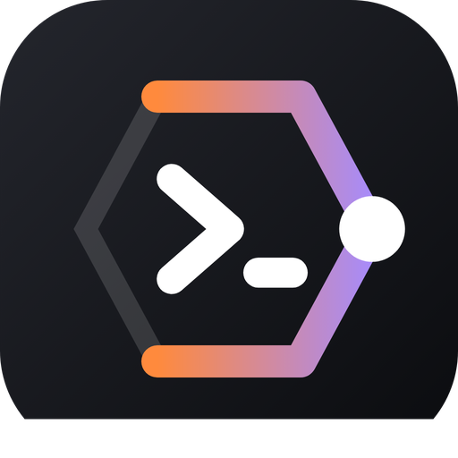

<p align="center">
  
</p>

<h1 align="center">ADE — Agentic Development Environment</h1>

<p align="center">
  <a href="https://github.com/alvin-reyes/better-agentic-ide/releases"></a>
  <a href="https://github.com/alvin-reyes/better-agentic-ide/blob/main/LICENSE"></a>
  <a href="https://github.com/alvin-reyes/better-agentic-ide/stargazers"></a>
  <a href="https://docs.anthropic.com/en/docs/claude-code"></a>
</p>

<p align="center">A desktop terminal built for running AI coding agents. Split panes, a prompt scratchpad, a file viewer, and a live fleet view of every agent across every terminal — all keyboard-first.</p>

<p align="center">
  <a href="https://alvin-reyes.github.io/better-agentic-ide/"><strong>Website</strong></a> ·
  <a href="https://alvin-reyes.github.io/better-agentic-ide/guide/"><strong>User guide</strong></a> ·
  <a href="https://github.com/alvin-reyes/better-agentic-ide/actions/workflows/ci.yml"></a>
</p>

Built with [Tauri v2](https://v2.tauri.app/) (Rust) + React 19 + TypeScript + [xterm.js](https://xtermjs.org/) + Zustand.

## Install

### Homebrew (macOS)

```bash
brew install --cask alvin-reyes/tap/ade
```

Upgrade with `brew upgrade --cask ade`. The cask clears the quarantine flag, so there's no Gatekeeper prompt.

### Download

Grab the installer for your platform from the [latest release](https://github.com/alvin-reyes/better-agentic-ide/releases/latest):

| Platform | File |
|----------|------|
| macOS (Apple Silicon) | `Better.Terminal_<version>_aarch64.dmg` |
| macOS (Intel) | `Better.Terminal_<version>_x64.dmg` |
| Windows | `.msi` or `-setup.exe` |
| Linux | `.deb` or `.AppImage` |

> **macOS manual install:** if macOS says the app "is damaged", run `xattr -cr "/Applications/Better Terminal.app"`.

### Requirements

- [Claude Code](https://docs.anthropic.com/en/docs/claude-code) for the AI agent features (`npm install -g @anthropic-ai/claude-code`). Codex, Gemini CLI and Ollama are also supported by the agent picker.

## Features

### Terminal
- **Named tabs** — create (`Cmd+T`), rename (`Cmd+R` or double-click), switch (`Cmd+1-9`, `Cmd+Shift+[` / `]`)
- **Split panes** — horizontal (`Cmd+D`) or vertical (`Cmd+Shift+D`), drag to resize, zoom one pane (`Cmd+Shift+Enter`), move between panes (`Cmd+←/→`)
- **Persistent sessions** — terminals survive splits and tab switches
- **Search** (`Cmd+F`) — incremental search with case-sensitive, whole-word and regex toggles; `Enter` / `Shift+Enter` step through matches
- **Detach to window** — right-click a tab → *Move to New Window*; the processes keep running
- **Recording & playback** — the `REC` button on a pane records its output; replay from *View Recordings* in the command palette at 1×/2×/4×

### Thoughts Scratchpad
- **Toggle** with `Cmd+J` — cycles focus between the scratchpad and the terminal
- **Send to terminal** with `Cmd+Enter`; **send a bare Enter** with `Cmd+E` to answer agent prompts without switching focus
- **Copy** with `Cmd+Shift+Enter`, **save as note** with `Cmd+S`
- **Prompt history & templates** — every sent prompt is saved and searchable
- **Prompt chaining** — separate prompts with `---` to run them in sequence, waiting for the agent to finish between steps
- **Voice dictation** — microphone button (Web Speech API)

### Files
- **File browser** (`Cmd+B`) — a tree of the active terminal's folder that follows `cd` and refreshes when files change; `.*` toggles hidden files
- **File viewer** — click any file to open it in a tab that picks the right view:
  - **PDF** — page through and zoom (rendered with pdf.js, so it works on Linux too)
  - **Word (.docx)** — a readable rendering of the document
  - **Images** — PNG, JPEG, GIF, SVG, WebP, BMP, ICO
  - **Markdown** — rendered, including ```` ```mermaid ```` diagrams, with a *Source* toggle for editing
  - **HTML** — static render (no scripts) with a *Source* toggle
  - **Everything else** — the Monaco code editor with syntax highlighting; `Cmd+S` saves
- **Mermaid diagrams** — `.mmd` files open with a live diagram preview and a chat box that edits the diagram through a local Ollama model
- Rendered markdown and documents are sanitized before display, so a malicious README can't run code

### Preview Panel
- **Side-by-side preview** (`Cmd+Shift+B`) of HTML, images, PDF and markdown next to your terminal. Click any file path a command or agent prints (`Write(docs/plan.md)`, `./report.pdf`) to open it
- **Live refresh** — updates on save through a native filesystem watcher; handy for watching an agent write a spec
- Also opens when you click a file path in the terminal

### AI Agents
- **Agent picker** (`Cmd+Shift+A`) — 37 pre-configured agent profiles across Backend, Frontend, DevOps, Testing, Web3, Architects and General (debugging, code review, docs, architecture, git, contract auditing and more)
- **Architects to brainstorm with** — AI Agent, RAG & Knowledge, Workflow Automation, LLMOps, AI Automation Strategist, DeFi Protocol, Tokenomics, Smart Contract Systems, Web3 Infrastructure, Cross-chain & L2, and AI x Web3. They ask questions, compare options, draw Mermaid diagrams and record decisions as ADRs in `docs/adr/` instead of writing code
- **Task routing** — describe a task and the picker suggests the best-matching agent
- **Providers** — Claude Code, Codex, Gemini CLI or Ollama
- **Continuous mode** — autonomous runs with `--dangerously-skip-permissions` (with a safety warning)
- Each agent gets its own named, color-coded tab

### Fleet View
- **One terminal or all of them** — `Cmd+.` opens the fleet panel; toggle between *This terminal* and *All terminals*. *Fleet: All terminals* in the command palette opens it as a full tab.
- **All terminals** — a section per terminal tab showing its folder, its agents and the Claude Code sub-agents they spawned, with running count and cost per terminal; *Go to tab* jumps straight there
- **Timeline** — swimlanes of every agent and sub-agent over the last 5 min / 15 min / 1 h / all time; click an agent to jump to its pane
- **Cost tracking** — estimated tokens and cost per session for Claude, Codex and Gemini, plus session history
- **Notifications** — a system notification and in-app toast when an agent finishes

### Orchestrator
- **Plan with an AI, then dispatch** (`Cmd+Shift+O`) — chat through a project in the Orchestrator tab (type in the scratchpad), and it breaks the work into tasks with an agent profile, priority and dependencies
- **Dispatch** a task, or *Dispatch All* ready tasks, each into its own terminal running `claude` with the task and a generated `SPEC.md`
- Uses the Anthropic API (key in *Settings → AI API*) or a local Ollama model

### BMAD Method
- **One-click setup** — ADE offers to install a bundled, pinned copy of [BMAD-METHOD](https://github.com/bmad-code-org/BMAD-METHOD) into a project (`.bmad-core/` plus Claude Code commands); nothing is downloaded and existing files are never overwritten
- **Persona panel** — launch the Analyst, PM, UX Expert, Architect, Product Owner, Scrum Master, Developer or QA persona in the active terminal

### Smart Contracts
- **Contracts panel** (`Cmd+Shift+K`) — detects Foundry, Hardhat or Anchor from the terminal's folder and lists the installed tools, your contract sources and compiled ABIs
- **One-click actions** — build, test (with traces, gas report, coverage, gas snapshot), format, and Slither/Aderyn analysis run in the terminal from the project root; Anvil, a Hardhat node or `solana-test-validator` starts in its own tab
- **Workbench** — a tab per Foundry project to compile with clickable errors, run each test function on its own (gas, fuzz runs, failure reason, traces), and deploy to and call contracts on Anvil, with events and custom-error reverts decoded against the ABI
- **Safe deploys** — deploy commands for each `script/*.s.sol` or Ignition module are typed but not run, and use Foundry keystore accounts; ADE never handles private keys
- **ABI viewer** — compiled artifacts open as read/write functions, events and errors with their selectors (keccak-256, click to copy); Anchor IDLs show instructions and accounts
- **Web3 agents** — Smart Contract Engineer, Smart Contract Auditor, Gas Optimizer and Solana/Anchor Engineer in the agent picker
- Solidity syntax highlighting; compiler error locations are clickable

### Browser Tab
- **Open Browser Tab** from the command palette to view a local dev server (defaults to `http://localhost:3000`) inside ADE

### Auto-save, Restore & Sync
- **Auto-save** — tabs, splits, each terminal's folder and scrollback, open file tabs, the unsent scratchpad draft, notes, prompt history, settings, workspaces and orchestrator history are written to disk within a second of changing. A crash or force-quit brings everything back.
- **Snapshots** — taken at startup and every 10 minutes (newest 20 kept); restore one from *Settings → Sync*.
- **Sync between machines** — point *Settings → Sync* at a private git repo you own. Settings, notes, prompt history, workspaces and orchestrator history are shared (newest change wins); each machine's session is kept under its own device name. Changes from other machines apply when ADE starts; local changes are pushed every 3 minutes and on close.
- **Claude memory** — optionally syncs `~/.claude/CLAUDE.md` and your custom commands, agents and skills. If a file was edited on two machines, your copy is kept and the other version is saved next to it as `*.sync-conflict`.
- **Secrets stay local** — API keys are stripped before anything is written to the sync repo.
- **claude-mem** — detected and left to claude-mem's own Cloud Sync: its live SQLite database can't be safely copied between machines.

### Theming & Settings
- **8 built-in themes** — GitHub Dark, Dracula, Monokai Pro, Nord, Catppuccin Mocha, Solarized Dark, Tokyo Night, One Dark
- **Fonts** — size (10–24px), family (JetBrains Mono, SF Mono, Fira Code, Cascadia Code, …), line height
- **Custom colors** — override any UI or terminal color
- **Cursor** — bar, block or underline, optional blink; configurable scrollback
- **Workspaces** — save and restore tab layouts by name

## Keyboard Shortcuts

On Linux and Windows, app shortcuts use `Ctrl+Shift` where macOS uses `⌘`, and `Ctrl+Alt+Shift` where macOS uses `⌘⇧`. Plain `Ctrl` keys always go to the terminal, so `Ctrl+D`, `Ctrl+R`, `Ctrl+W`, `Ctrl+E`, `Ctrl+P` and the rest keep working in your shell. On macOS, `Ctrl` keys go to the terminal too.

| macOS | Linux / Windows | Action |
|---|---|---|
| `⌘P` | `Ctrl+Shift+P` | Command palette |
| `⌘T` | `Ctrl+Shift+T` | New tab |
| `⌘W` | `Ctrl+Shift+W` | Close tab |
| `⌘1-9` | `Ctrl+Shift+1-9` | Switch to tab N |
| `⌘⇧[` / `⌘⇧]` | `Ctrl+PageUp` / `Ctrl+PageDown` (or `Ctrl+Alt+Shift+[` / `]`) | Previous / next tab |
| `⌘R` | `Ctrl+Shift+R` | Rename active tab |
| `⌘D` | `Ctrl+Shift+D` | Split pane horizontally |
| `⌘⇧D` | `Ctrl+Alt+Shift+D` | Split pane vertically |
| `⌘⇧W` | `Ctrl+Alt+Shift+W` | Close active pane |
| `⌘←` / `⌘→` | `Ctrl+Shift+Left` / `Right` | Move between panes (outside text fields) |
| `⌘⇧↵` | `Ctrl+Alt+Shift+Enter` | Zoom / unzoom pane (outside the scratchpad) |
| `⌘F` | `Ctrl+Shift+F` | Search in terminal |
| `⌘J` | `Ctrl+Shift+J` | Toggle scratchpad / cycle focus |
| `⌘↵` | `Ctrl+Shift+Enter` (or `Ctrl+Enter` in the scratchpad) | Send scratchpad to terminal |
| `⌘⇧↵` | `Ctrl+Alt+Shift+Enter` | Copy scratchpad (while typing in it) |
| `⌘S` | `Ctrl+Shift+S` (or `Ctrl+S` in the scratchpad) | Save scratchpad as note |
| `⌘E` | `Ctrl+Shift+E` | Send Enter to terminal |
| `⌘B` | `Ctrl+Shift+B` | Toggle file browser |
| `⌘⇧B` | `Ctrl+Alt+Shift+B` | Toggle preview panel |
| `⌘⇧A` | `Ctrl+Alt+Shift+A` | AI agent picker |
| `⌘.` | `Ctrl+Shift+.` | Fleet view |
| `⌘⇧O` | `Ctrl+Alt+Shift+O` | Orchestrator |
| `⌘⇧K` | `Ctrl+Alt+Shift+K` | Smart contracts panel |
| `⌘,` | `Ctrl+Shift+,` | Settings |
| `Esc` | `Esc` | Close open panels and focus the terminal |

The code editor keeps its usual `⌘S` / `Ctrl+S` to save the file.

**Clickable files:** any file path printed in a terminal, such as `Write(docs/plan.md)`, `./out/report.pdf` or `src/App.tsx:42`, is a link once the file exists. Relative paths resolve against the terminal's current folder. Markdown, HTML, PDFs and images open in the preview panel beside the terminal; other files open in a tab.

## Development

```bash
# Prerequisites: Node.js 18+, Rust (stable); on Linux also the Tauri system libraries:
# https://v2.tauri.app/start/prerequisites/
npm install
npm run tauri dev       # run the app with hot reload
npm run tauri build     # build installers for your platform

npm test                # frontend unit tests (Vitest)
npx tsc --noEmit        # typecheck
(cd src-tauri && cargo test)   # backend unit tests
```

CI runs the typecheck, frontend tests, a production build and the Rust tests on every pull request.

### Releasing

1. Bump `version` in `src-tauri/tauri.conf.json` and merge to `main`.
2. Push a tag (`git tag v<version> && git push origin v<version>`), or run *Build & Release Installers* from the Actions tab with the tag as input. The workflow builds macOS (ARM + Intel), Windows and Linux installers and attaches them to a GitHub release.
3. Update the Homebrew cask in [alvin-reyes/homebrew-tap](https://github.com/alvin-reyes/homebrew-tap): `scripts/update-homebrew-cask.sh <version> ../homebrew-tap/Casks/ade.rb`, then commit and push the tap.

### macOS signing and the official Homebrew listing

Release builds are signed and notarized automatically once all of these repository secrets exist (until then macOS builds are unsigned): `APPLE_CERTIFICATE` (base64 of the Developer ID Application `.p12`: `openssl base64 -A -in cert.p12`), `APPLE_CERTIFICATE_PASSWORD`, `APPLE_SIGNING_IDENTITY` (e.g. `Developer ID Application: Name (TEAMID)`), `APPLE_ID`, `APPLE_PASSWORD` (an app-specific password) and `APPLE_TEAM_ID`.

`packaging/homebrew/better-terminal.rb` is the draft for [homebrew/cask](https://github.com/Homebrew/homebrew-cask). Until it's accepted, the [alvin-reyes/tap](https://github.com/alvin-reyes/homebrew-tap) cask above is the way to install with Homebrew. Where things stand against Homebrew's [acceptance policy](https://docs.brew.sh/Package-Acceptance-Policy) and [cask rules](https://docs.brew.sh/Acceptable-Casks):

| Requirement | Status |
|---|---|
| Stable, versioned releases | ✅ |
| Repository at least 30 days old | ✅ |
| Runs natively on Apple Silicon (no Rosetta) | ✅ |
| Signed and notarized, passes Gatekeeper | ⏳ needs the Apple secrets above |
| Notability: **75 stars, 30 forks or 30 watchers** if a user submits it; **225 stars, 90 forks or 90 watchers** if we submit it ourselves | ⏳ |

Once releases are signed and one notability threshold is met, submit the draft cask pointing at the signed release.

## Architecture

```
better-agentic-ide/
├── src-tauri/                 Rust backend
│   └── src/
│       ├── main.rs            App entry point
│       ├── lib.rs             Tauri command registration, file commands
│       ├── pty.rs             PTY management (portable-pty + Channel API)
│       ├── watcher.rs         Native filesystem watcher (notify)
│       ├── subagent.rs        Claude Code sub-agent transcript watcher (fleet view)
│       ├── state.rs           Durable app state on disk (atomic writes, snapshots)
│       ├── sync.rs            Git-backed sync of state and Claude memory
│       └── bmad.rs            BMAD scaffolding and status
├── src/                       React frontend
│   ├── components/
│   │   ├── TabBar.tsx, PaneContainer.tsx, TerminalPane.tsx    Tabs, splits, xterm.js panes
│   │   ├── Scratchpad.tsx     Thoughts panel, history, notes, chaining
│   │   ├── FileBrowser.tsx    File tree side panel
│   │   ├── EditorTab.tsx      File tab: picks a viewer or the editor
│   │   ├── viewer/            PDF, .docx, image, markdown and HTML viewers
│   │   ├── editor/            Monaco wrapper, Mermaid preview, diagram chat
│   │   ├── fleet/             Fleet panel, tab, per-terminal groups, timeline
│   │   ├── PreviewPanel.tsx   Side-by-side live preview
│   │   ├── AgentPicker.tsx    Agent launcher and task routing
│   │   ├── OrchestratorTab.tsx, BmadPanel.tsx, BrowserTab.tsx
│   │   ├── RecordingControls.tsx, RecordingPlayer.tsx, TerminalSearch.tsx
│   │   └── CommandPalette.tsx, SettingsPanel.tsx, ShortcutsBar.tsx, Tour.tsx
│   ├── stores/                Zustand stores (tabs, settings, fleet, agents, orchestrator, BMAD)
│   ├── hooks/                 Terminal lifecycle, keybindings, fleet data, recording
│   ├── lib/                   Auto-save and sync clients, viewer dispatch, sanitizing, Mermaid, Anthropic
│   └── data/                  Agent profiles, task router, BMAD personas
└── .github/workflows/         CI and release builds
```

### Key design decisions

- **Global terminal instance map** — terminal instances live outside React in a `Map` so they survive remounts during splits
- **Tauri Channel API** — PTY output and watcher events stream over `Channel`s
- **One watcher per folder** — the fleet view refcounts a sub-agent watcher per terminal folder, so several views share them
- **Sanitize before render** — the webview can reach Tauri IPC, so markdown and documents from any repo go through DOMPurify and Mermaid's strict mode
- **Disk is the source of truth** — stores keep using localStorage, but it is hydrated from `<app data>/state` before the app loads and every change is mirrored back to disk, so state survives crashes, profile resets and can be synced

## Tech Stack

| Layer | Technology |
|---|---|
| Desktop framework | Tauri v2 |
| Backend | Rust + portable-pty + notify |
| Frontend | React 19 + TypeScript |
| Terminal | xterm.js + WebGL addon |
| Editor & viewers | Monaco, pdf.js, mammoth, marked, Mermaid |
| State | Zustand |
| Styling | Tailwind CSS v4 + CSS variables |

## Contributing

See [CONTRIBUTING.md](CONTRIBUTING.md).

## License

ISC
