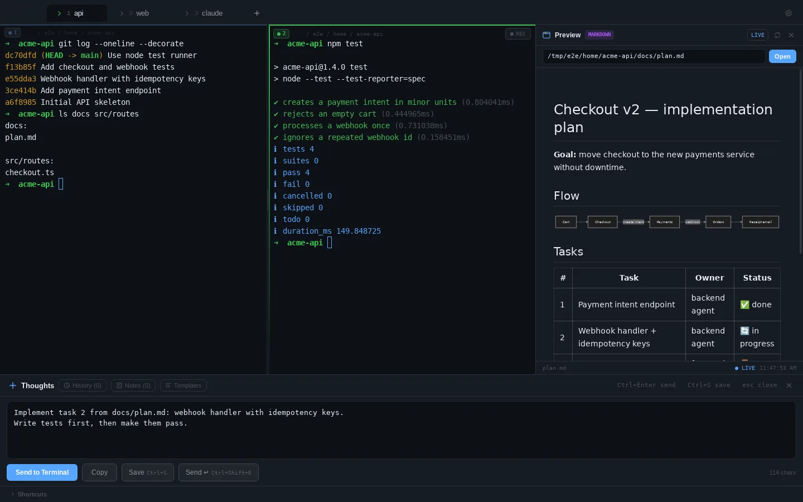
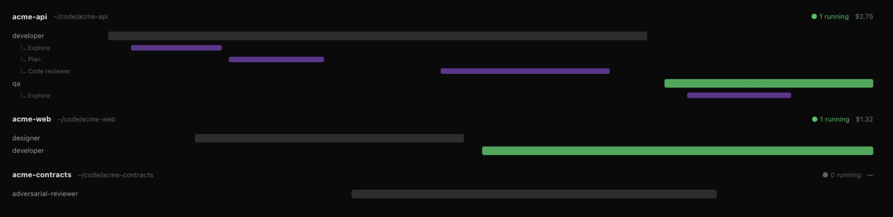
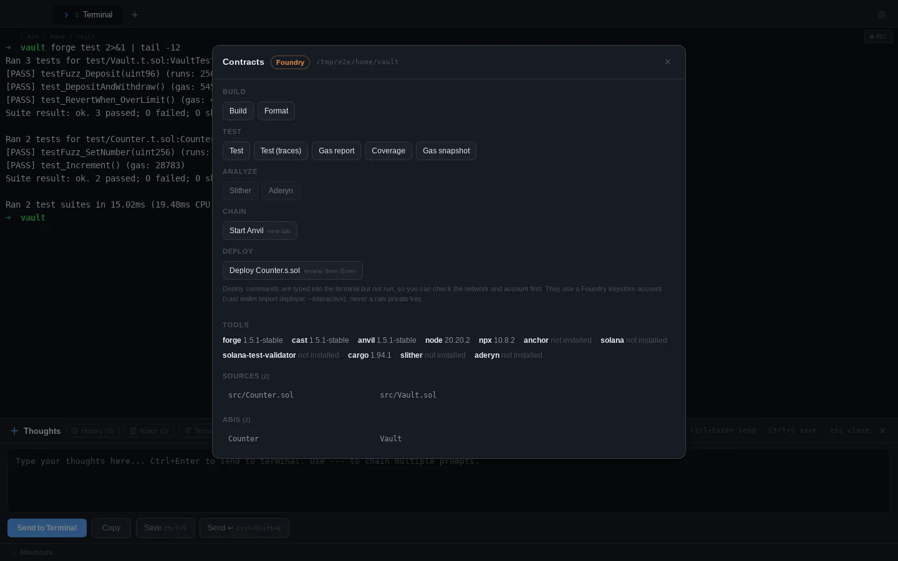

<p align="center">
  
</p>

<h1 align="center">ADE: Agentic Development Environment</h1>

<p align="center"><strong>The terminal for building products with AI.</strong></p>

<p align="center">
  <a href="https://github.com/alvin-reyes/better-agentic-ide/actions/workflows/ci.yml"></a>
  <a href="https://github.com/alvin-reyes/better-agentic-ide/releases/latest"></a>
  <a href="https://github.com/alvin-reyes/better-agentic-ide/releases"></a>
  
  <a href="LICENSE"></a>
  <a href="https://github.com/alvin-reyes/ade-setup/releases/latest"></a>
</p>

<p align="center">
  <a href="https://ade.ardata.tech/"><strong>Website</strong></a> ·
  <a href="https://github.com/alvin-reyes/better-agentic-ide"><strong>Source</strong></a> ·
  <a href="https://ade.ardata.tech/guide/"><strong>User guide</strong></a> ·
  <a href="https://github.com/alvin-reyes/better-agentic-ide/releases/latest"><strong>Download</strong></a>
</p>

<p align="center">
  
</p>

ADE is a desktop IDE for macOS and Linux built around **Claude Code**, with Codex, Gemini and local models running alongside it. Every project gets a methodology and a team of agents, and you see exactly what each one costs. It goes furthest on serious engineering work: nineteen roles that cover a whole company, a verification gate that decides when a story is actually done, and smart contracts from first test to reviewed deploy.

## AI Agents

- **Many agents at once**: run Claude Code, Codex, Gemini or any CLI agent in parallel tabs and split panes. The fleet view tracks every agent and sub-agent on a live timeline with its real cost.
- **47 agent profiles**: Backend (including senior Go and Rust engineers), Frontend, Mobile, Data, DevOps, Testing, Security, Web3, Architects and General. Pick one and run it in this terminal or a new tab.
- **One role, any CLI**: a profile composes one role definition in `~/.ade/roles/`, shared by every project; Claude Code, Gemini and Ollama (deepseek and other local models) each receive it the way they accept one. Codex is shown unavailable rather than guessing a flag that fails silently.
- **A whole company, not just a delivery team**: nineteen roles end to end, from analyst and product manager through developer and QA to security engineer, SRE, release manager, support and solutions engineering. The picker lists every one unpaired, so the roles no profile covers are still a keystroke away.
- **Project setup**: every project is set up for agents once, automatically. See [below](#project-setup).
- **The agents are a repo you can share**: every role definition lives in [ade-setup](https://github.com/alvin-reyes/ade-setup), versioned and released, and ADE ships a pinned copy. Improve a role there and it reaches your projects when you choose to update them, not on ADE's release schedule.
<p align="center">
  
</p>

- **Prompt scratchpad**: draft long prompts under every terminal with prompt tips and de-slop, send with one key, chain steps and reuse from history. Drafts survive crashes.
- **Tokens & cost**: spend at API prices, cache savings and context meters, plus one-click token savers (compact paste, context guard, context diet).
- **Anti-slop**: the ADE plugin for Claude Code (anti-slop skill, a slop check before Claude finishes, `/ade:deslop`, Web3/Go/Rust sub-agents and architect skills), plus a slop check on your uncommitted changes.
- **MCP library & Secrets vault**: 15 curated MCP servers added to `.mcp.json` in one click, with `${NAME}` references to secrets kept in your OS keychain and never synced.

### Project setup

Every project ADE opens (New project, Open project, or any git repo a terminal enters) is set up once:

- **BMAD**, on every project and actually used: `.bmad-core/` with its tasks, checklists, templates and workflows. Eight roles name the tasks that do their job instead of improvising: the Scrum Master shards with `create-next-story`, QA traces criteria with `trace-requirements`. Its ten personas are not installed.
- **The ADE methodology**, "verified, not vibed": Plan → Approve → Shard → Build → Verify. A story is Done only when the agreed verification command passes, and no agent certifies its own work. The rules live in `.ade/rules.md`, loaded from `CLAUDE.md`, alongside a context store, a decision log and a session journal.
- **Eight core roles** as Claude Code sub-agents in `.claude/agents/`: product manager, architect, designer, scrum master, developer, QA, DevOps and adversarial reviewer.
- **A knowledge store the agents write to**: `.ade/knowledge/<role>.md`, committed with your repo. A role records what it learned here (a flaky suite to serialise, a build step with a hidden prerequisite) and reads it back next run instead of rediscovering it. An update never touches it.
- **Agents for your stack**, detected from the project: Solidity and audit agents for Foundry or Hardhat, Anchor and Rust agents for Solana, a senior Go engineer for `go.mod`, a senior Rust engineer for `Cargo.toml`.

Only missing files are written, and the toast that lists them has Undo. Add or remove agents any time in *Integrations → Agents*; turn automatic setup off in *Settings → Terminal*. See the [project setup guide](https://ade.ardata.tech/guide/project-setup/).

## Blockchain Engineering Tooling

- **Contracts panel**: one key opens build, test, gas report, coverage, Slither and Aderyn analysis and a local chain for Foundry, Hardhat and Anchor projects.
<p align="center">
  
</p>

- **Workbench**: run Foundry tests one at a time with gas, fuzz runs and counterexamples, then deploy and call contracts on Anvil with decoded events and reverts.
- **Reviewed deploys**: real-network deploy commands are typed into the terminal for you to review, never run automatically. ADE never handles, stores or syncs private keys.
- **ABI viewer**: functions, events and errors with their selectors, and Anchor IDLs with their accounts.
- **Web3 agents**: Solidity engineer (test-first, fuzz and invariant tests), smart contract auditor (reentrancy, access control, oracle and MEV, with proof-of-concept tests), gas optimizer, Solana/Anchor engineer, Web3 DevOps, and architects for DeFi, tokenomics, infrastructure and cross-chain.

## Also in ADE

- **Clickable files, live preview and an editor**: Markdown with Mermaid, PDF, Word, images and HTML open beside the terminal; a source file opens in a Monaco editor tab that saves back to disk, with a live diagram pane for `.mmd` files.
- **Voice dictation**: talk into the scratchpad instead of typing a long prompt.
- **Auto-save and sync**: sessions restore after a crash; settings, notes and Claude memory sync through your own private git repo.
- **Precision**, the default theme, with eight more presets (GitHub Dark, Dracula, Monokai Pro, Nord, Catppuccin Mocha, Solarized Dark, Tokyo Night, One Dark), per-colour overrides and a terminal palette that stays legible against the UI. The saved theme paints before the first frame, so a cold start never flashes.

## Install

**Homebrew (macOS)**

```bash
brew install --cask alvin-reyes/tap/ade
```

**Installers**: download from the [latest release](https://github.com/alvin-reyes/better-agentic-ide/releases/latest): `.dmg` for macOS (Apple Silicon and Intel) and `.deb` or `.AppImage` for Linux.

ADE works with [Claude Code](https://docs.anthropic.com/en/docs/claude-code), Codex, Gemini CLI and Ollama. See the [user guide](https://ade.ardata.tech/guide/) to get started.

## Licence

ADE is free and open source under the [MIT licence](LICENSE). Every feature, no account, no keys, no telemetry. Use it at work, fork it, ship your own build, no permission needed.

Issues and pull requests are welcome, on the app and on [ade-setup](https://github.com/alvin-reyes/ade-setup), where the agent definitions live. [CONTRIBUTING.md](CONTRIBUTING.md) has the build steps, what CI checks, and a path in that needs no Rust: the nineteen roles are markdown.

## Used on real work

ADE is the tool behind [ardata.tech](https://ardata.tech)'s projects. The agent fleet, the methodology and the contract tooling exist because client work needed them, not as a demo. It is also the tool used in [ardata academy](https://ardata.academy)'s AI training, the same setup in every lesson.

More on the [website](https://ade.ardata.tech/#built-with).

## Support

For help, licensing and team purchases, get in touch via the [website](https://ade.ardata.tech/). The [troubleshooting guide](https://ade.ardata.tech/guide/troubleshooting/) covers common issues.

© 2025–2026 Alvin Reyes · [MIT](LICENSE)
